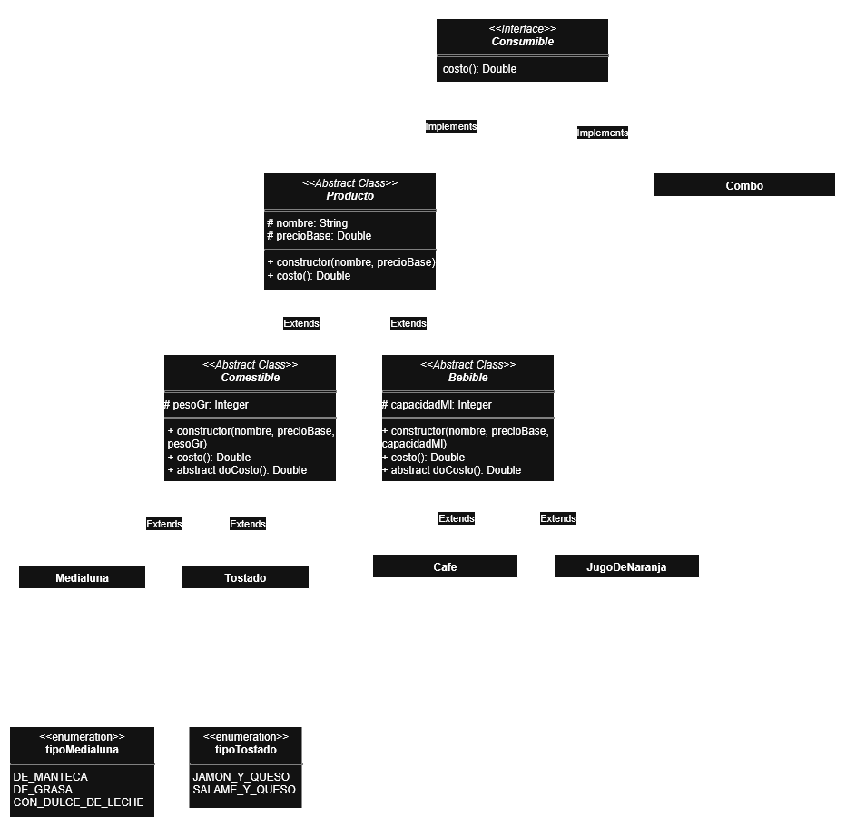

# Proyecto Java – Patrones de Diseño (Composite, Strategy y Template Method)

## 🎯 Objetivo
El objetivo de este proyecto es que puedan realizar un proyecto siguiendo el diagrama UML provisto.  
Durante el desarrollo se aplicarán los patrones de diseño:
- **Composite**  
- **Strategy**
- **Template Method**

---

